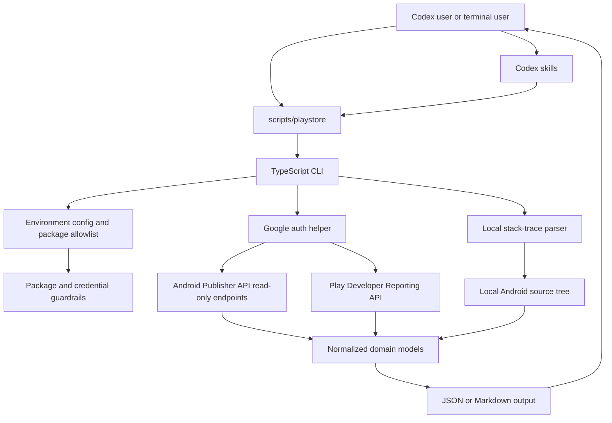

# Architecture

The plugin is a read-only local workflow layer around Google Play APIs and local Android source inspection.

## Components

- Codex skills: guided workflows in `skills/` that tell Codex when and how to run the CLI.
- CLI wrapper: `scripts/playstore`, a stable entrypoint that runs the built TypeScript CLI.
- CLI package: `cli/src`, including commands, clients, schemas, domain logic, and tests.
- Config guardrails: environment parsing, credential checks, default package checks, and package allowlist enforcement.
- Google API clients: thin read-only clients for Android Publisher and Play Developer Reporting endpoints.
- Domain logic: release health summaries, issue ranking, regression detection, review signal classification, anomaly summaries, rollout-risk scoring, and stack-trace triage.
- Output layer: JSON for machine reasoning and Markdown for user-facing reports.

## Read-Only Boundary

All Google API calls are inspection calls. The plugin does not implement rollout changes, track edits, review replies, release promotion, or any mutation command.

`report rollout-risk` produces an inferred recommendation from measured facts. Even the strongest category, `manually halt rollout outside the plugin`, is a manual action for a human release owner in Play Console.

## Data Boundary

- Environment variables or plugin-root `.env` configure credentials and allowed package names.
- Credentials and tokens are never printed.
- Review text is redacted by default.
- Fetched API data, raw reports, stack traces, and local scratch files are not committed.
- Example fixtures under `examples/fixtures/` are fake mocked responses only.
